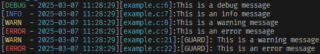
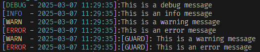
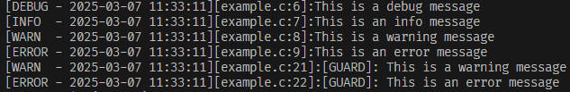

# CLog

CLog is a lighwieght logging library designed to help developers easily log and manage log information.

## Features

- 🐞 Supports multiple log levels: DEBUG, INFO, WARN, ERROR
- 🎨 Color-coded log messages for terminal output
- 📝 File logging support
- 💻 Platform detection for Windows, Linux, and macOS
- ⚙️ Customizable log levels
- 📄 Header-only library

## Usage

### Basic Usage

Log messages to the terminal with different log levels. This example shows how to log debug, info, warning, and error messages.

```c
#include "clog.h"

int main() {
    clog_debug("This is a debug message\n");
    clog_info("This is an info message\n");
    clog_warn("This is a warning message\n");
    clog_error("This is an error message\n");
    return 0;
}
```

### File Logging

Log messages to a file instead of the terminal. This example demonstrates logging to a file with different log levels.

```c
#include "clog.h"

int main() {
    FILE* fp = fopen("example.log", "w");
    clog_fdebug(fp, "This is a debug message\n");
    clog_finfo(fp, "This is an info message\n");
    clog_fwarn(fp, "This is a warning message\n");
    clog_ferror(fp, "This is an error message\n");
    fclose(fp);
    return 0;
}
```

### Guarded Logging

Temporarily change the log level for a block of code. This example shows how to use guarded logging to log messages with a specific log level.

```c
#include "clog.h"

int main() {
    clog_guard(CLOG_LEVEL_WARN, {
        clog_debug("[GUARD]: This is a debug message\n");
        clog_info("[GUARD]: This is an info message\n");
        clog_warn("[GUARD]: This is a warning message\n");
        clog_error("[GUARD]: This is an error message\n");
    });
    return 0;
}
```

### Disable colorful output

By default, CLog uses colorful output for log messages. To disable colorful output, define `CLOG_NCOLOR` before including the `clog.h` header file.

```c
#define CLOG_NCOLOR
#include "clog.h"
```

or `CLOG_NCOLOR` can be defined as a compiler flag.

```bash
gcc -DCLOG_NCOLOR -o example example.c
```

### Disable logging

To disable logging in a release build, define `CLOG_DISABLE` before including the `clog.h` header file.

```c
#define CLOG_DISABLE
#include "clog.h"
```

or `CLOG_DISABLE` can be defined as a compiler flag.

```bash
gcc -DCLOG_DISABLE -o example example.c
```

### Full Example

The following example demonstrates how to use CLog to log messages to the terminal and a file.

```c
#include "clog.h"

int
main()
{
  clog_debug("This is a debug message\n");
  clog_info("This is an info message\n");
  clog_warn("This is a warning message\n");
  clog_error("This is an error message\n");

  FILE* fp = fopen("example.log", "w");
  clog_fdebug(fp, "This is a debug message\n");
  clog_finfo(fp, "This is an info message\n");
  clog_fwarn(fp, "This is a warning message\n");
  clog_ferror(fp, "This is an error message\n");
  fclose(fp);

  clog_guard(CLOG_LEVEL_WARN, {
    clog_debug("[GUARD]: This is a debug message\n");
    clog_info("[GUARD]: This is an info message\n");
    clog_warn("[GUARD]: This is a warning message\n");
    clog_error("[GUARD]: This is an error message\n");
  });
}
```

Compile the example with the following command:

```bash
gcc -o example example.c
./example
```



```bash
gcc -o example example.c -DNDEBUG
./example
```



```bash
gcc -o example example.c -DCLOG_NCOLOR
./example
```



## License

This project is licensed under the MIT License.
